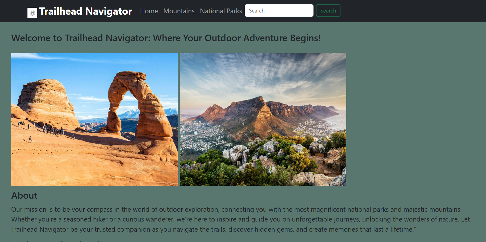
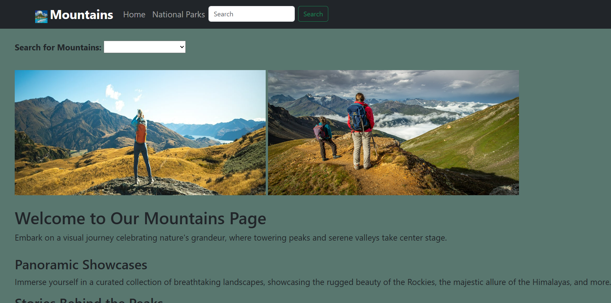
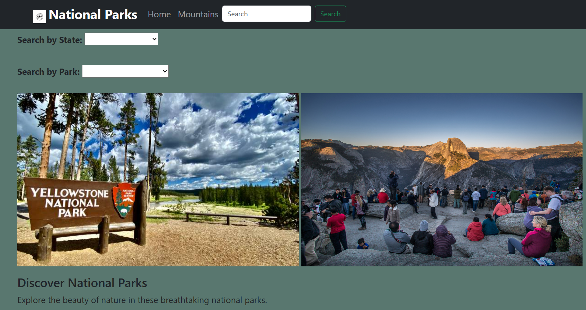

# Capstone 2: Enjoy the Outdoors

## Project Description: <br>
- This project was achieved and implemented using  HTML , CSS and JS. <br>
- It involves finding national parks and mountains across several states with a wide range of variety for all. <br>
- It consists of the Home page , Mountains Page and the National Parks page which all points you to your desired destination.

## Pages
 
### Home Page <br>

This is the landing page for our website and it includes navigation and highlights things that can help point you in the right direction.

<p align="center">
    
</p>

### Mountains Page

This is the Mountains page for our website which it includes details about various mountains across the country and highlights things that can help people enjoy the great outdoors.

<p align="center">
    
</p>


### National Parks Page

This page displays a wide range of national parks all over the country with a lot of helpful information which helps facilitates the process of picking out which of the parks to experience.  

<p align="center">
    
</p>


### Interesting code 

What makes this code interesting is:
- It facilitates a process that would have otherwise been more extensive.
-  It dynamically creates the options.


 ```
  selectByParkTypeEl.onchange = () => {
        selectByLocationNameEl.style.visibility = "visible";
        selectByLocationNameEl.options.length = 0;
        
        let option = new Option("");
        selectByLocationNameEl.appendChild(option);

        let selectedParkType = selectByParkTypeEl.value;
        
        for (let theNationalPark of nationalParksArray) {
            if (theNationalPark.LocationName.includes(selectedParkType)) {
                let option = new Option(theNationalPark.LocationName);
                selectByLocationNameEl.appendChild(option);
            }
        }
    };
 
```